# PadTap

Cybertruck center-console **wireless-charger tap** → **Starlink Mini**.

Two controller builds, one Y-harness:

| | **Direct 48 V** (default) | **Buck 36 V** (conservative) |
| --- | --- | --- |
| Mini sees | Raw Tesla rail, typically 44–50 V | Regulated 36.00 V |
| Extra DC-DC | None — FET + OVLO only | 60 V → 36 V buck |
| 58 V Tesla peak | FET opens at **56.0 V** | Buck absorbs it |
| Why | Mini input is 60 V-class silicon; skipping the buck saves 4–8 W | Stays inside the printed 12–48 V rating |

The Y-harness sits between Tesla PN **1877045** and the vehicle plug so the pad and the **key-card NFC reader stay alive**. A small board listens to the on-screen pad enable (almost certainly LIN, not a 48 V cut) and switches a 5.5 mm barrel.

This is **not** a Tesla-approved accessory point. Tesla’s approved 48 V taps are the roof and frunk feeds (400 W). Read [SAFETY.md](SAFETY.md) before you open the console.


## Drawings

All sources live in [`docs/diagrams/`](docs/diagrams/). SVGs are generated by `generate.py` (dark sheet, GitHub-safe). Enclosure photos are concept renders of the 108 × 56 × 18 mm sled — print the STLs, don’t mill the render.

### System


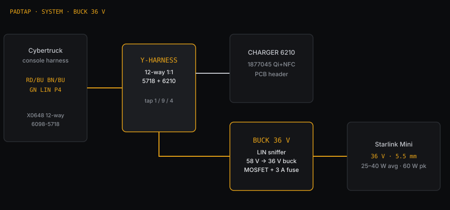

### Schematic — Direct 48 V

Low-side 100 V FET. Barrel center+ stays at VIN; sleeve is opened. LM393 + firmware kill the gate at 56.0 V.


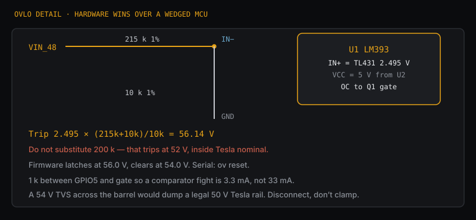

### Schematic — Buck 36 V

Same Y-harness and sled. A 60 V → 36 V module sits between the TVS and the FET so Tesla’s 58 V peak never reaches the Mini.

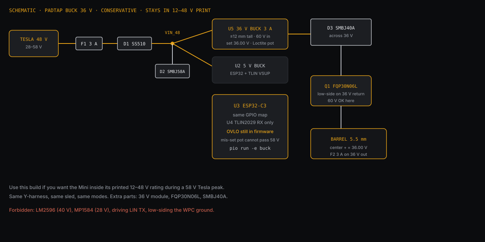

### Y-harness


### Enclosure

108 × 56 × 18 mm PETG. VHB the lid to the underside of a console panel. Comb west, barrel east, USB south.

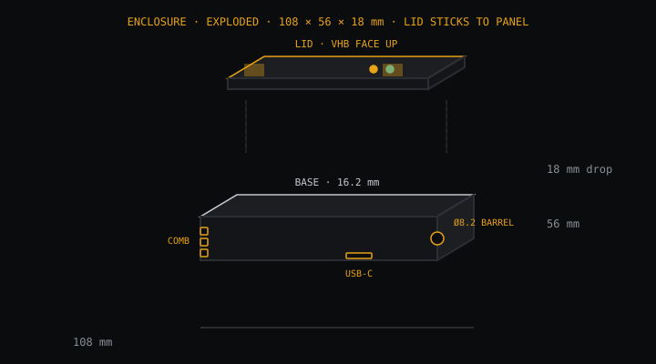

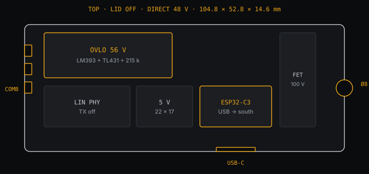


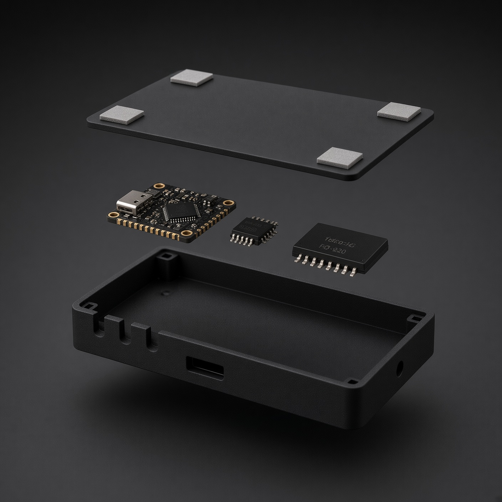

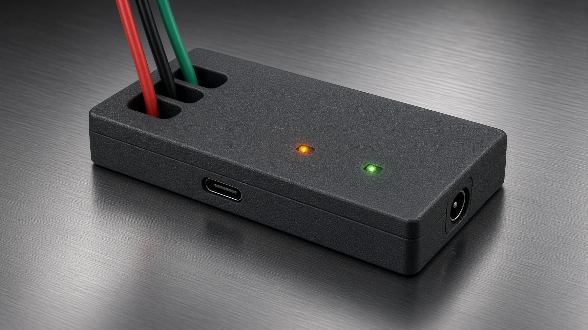

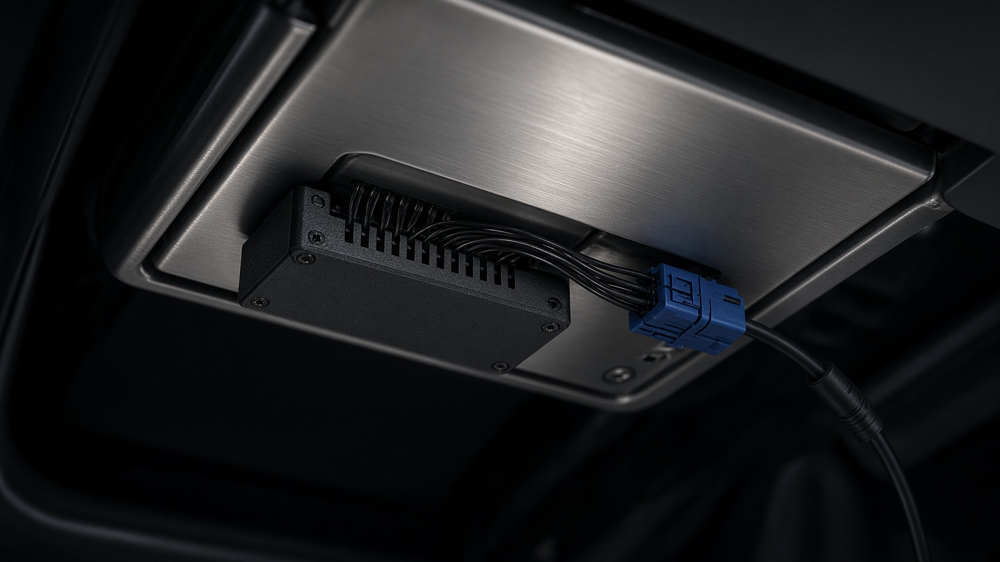

### Voltage and firmware

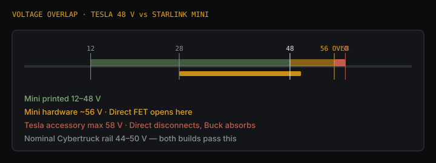

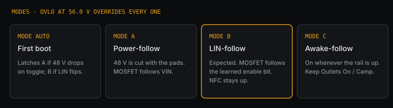

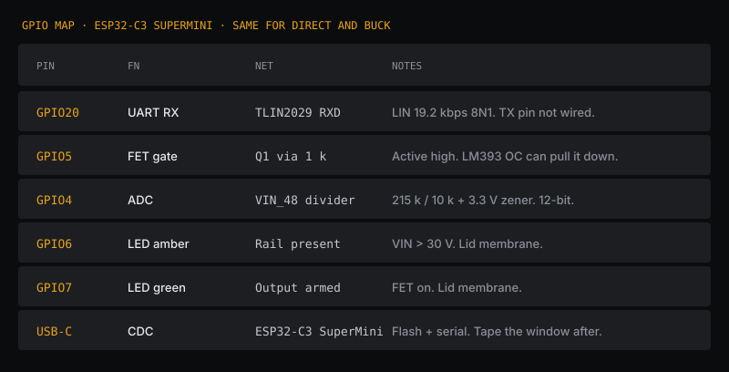

## Why this exists

You wanted 48 V out of the wireless-pad connector, switched from the screen (Controls → Outlets & Mods → Wireless Phone Charging Pads).

Three facts get in the way:

1. **Unplugging the pad kills NFC.** Same module. The tap must be a pass-through Y.
2. **The screen toggle is almost certainly LIN**, not a power cut. Tesla would not drop 48 V to this module just to disable Qi — that would kill the key card. Predecessor Model Y pads already talk LIN (NXP TJA1021). Firmware still auto-detects if Tesla *does* cut 48 V (Mode A).
3. **Raw Cybertruck 48 V can be 58 V.** Mini is printed 12–48 V. Teardown: 100 V input FETs, 60 V TVS — hardware takes ~56 V. Direct 48 V passes the nominal 44–50 V rail and **kills the FET at 56.0 V**. Buck 36 V if you want zero overvoltage risk.
4. **Tesla 48 V digital fuses trip on buck inrush, not watts.** A raw converter on the frunk tap does this. PadTap puts a **10 Ω NTC ICL on VIN** (harness, with the fuses) and **ramps the load FET 80 ms**. Do not skip the thermistor.

## What’s in this repo

| Path | |
| --- | --- |
| [docs/diagrams/](docs/diagrams/) | Schematics, harness, pin map, enclosure drawings, renders |
| [docs/research.md](docs/research.md) | Sources: Tesla DIY 48 V, WPC R&R, Mini teardown, Starlink spec |
| [hardware/harness.md](hardware/harness.md) | Y-harness, connector hunt, hypothesized 4-pin map |
| [hardware/schematic-direct.md](hardware/schematic-direct.md) | **Direct 48 V** — FET, LM393 OVLO, no buck |
| [hardware/schematic.md](hardware/schematic.md) | **Buck 36 V** — 60 V → 36 V module |
| [hardware/bom.csv](hardware/bom.csv) | Order list, `rev` column = `all` / `direct` / `buck` |
| [hardware/enclosure](hardware/enclosure) | Under-panel PETG sled — OpenSCAD + STL |
| [firmware/padtap](firmware/padtap) | ESP32-C3 PlatformIO. Env `direct` (default) or `buck` |

## Modes


| Mode | When | Behavior |
| --- | --- | --- |
| **AUTO** | First boot | Latches A if 48 V drops on toggle; B if LIN bit flips |
| **A** Power-follow | 48 V is cut with the pads | MOSFET follows VIN |
| **B** LIN-follow | Expected | MOSFET follows the learned LIN enable bit |
| **C** Awake-follow | Manual | On whenever the rail is up |

OVLO overrides every mode: VIN ≥ 56.0 V → FET off. Clears at 54.0 V. Serial `ov reset` to force.

## Probe first

Tesla’s connector pinout lives in **Service Mode Plus → Low Voltage → Wiring / Connector diagram** (the Cybertruck wiring guide). Search `wireless charger`, `WPC`, `1877045`, `NFC`. Screenshot ID, pins, colors, fuse.

Until that page is in-hand:

- Pin 1 ≈ 48 V+ (blue tape, blue housing)
- Pin 2 ≈ GND
- Pin 3 ≈ LIN (~12 V idle, 19.2 kbps)
- Pin 4 ≈ unknown — pass through

Owner reports say **four pins**. Do not crimp a GT150 (or anything else) until a photo of *your* plug matches.

Measure idle WPC current. If Tesla’s fuse cannot take pad + 60 W, **stop** and use the 400 W roof/frunk feed.

## Board

**Direct 48 V** (`pio run -e direct`)

- ESP32-C3 SuperMini
- TLIN2029A-Q1 or equivalent, **TX disconnected**
- 7–60 V → 5 V 2 A buck (not LM2596, not MP1584)
- **FQP13N10L** 100 V logic-level, laid flat (not the 60 V FQP30N06L)
- LM393 + TL431 OVLO at 56.14 V, open-collector on the gate
- **NTC 10 Ω ≥3 A ICL on VIN** (harness, next to the fuses — Tesla digital fuses trip on buck inrush; this is what stops a frunk 48 V tap from erroring)
- **80 ms FET ramp** (firmware PWM + 47 k / 1 µF) so Mini input caps don’t dump the pad circuit
- ATC 3 A in and out (on the harness, outside the box), SMBJ58A on VIN only

**Buck 36 V** (`pio run -e buck`)

- Same MCU / LIN / 5 V rail
- Low-profile 8–60 V → 36 V **3 A** buck, **≤ 12 mm tall**
- FQP30N06L + SMBJ40A on the 36 V output

```
cd firmware/padtap
pio run -e direct -t upload
pio device monitor -b 115200
```

Serial: `mode a` / `mode b` / `mode c` / `mode auto` / `ov reset`. First capture fills `firmware/padtap/src/lin_map.h`.

## Enclosure

Print `hardware/enclosure/padtap_case.scad` (PETG, 0.2 mm, 4 perimeters). Compact STLs in the same folder are slicer-legal. Confirm 18 mm of clearance before you glue.

Direct 48 V has more cavity — the 36 V module is gone. Same print either way.

## Install (short)

Tesla torque: T20, **5 N·m**. Official access: LH center floor rail → center-console front panel. Bench-test barrel polarity on the official Starlink PSU **before** the Mini sees the truck. Direct: confirm OVLO trips on a current-limited supply ramped through 56 V. Buck: confirm 36.00 V under a dummy load. First wake without Starlink: confirm key card and Qi. Then plug the Mini.

## Starlink barrel

5.5 mm OD. Spec sheet draws **2.5 mm** center pin; 2.1 mm plugs are widely used. Center **positive** — meter the wall wart.

## License

MIT. You are modifying a 48 V vehicle. That is on you.
