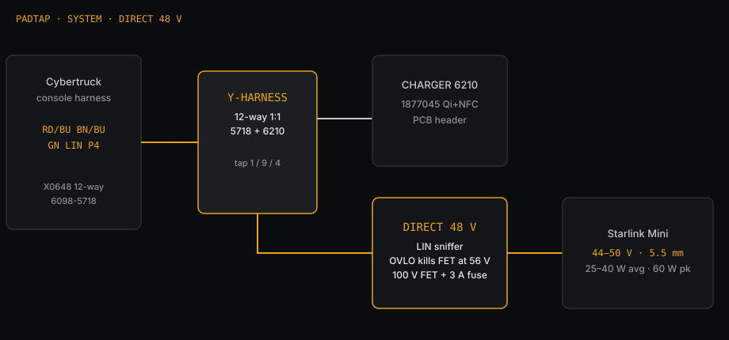
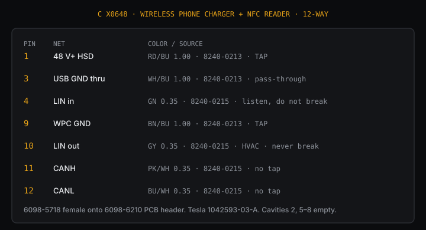
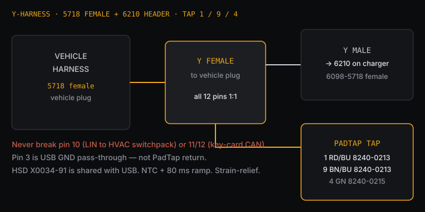
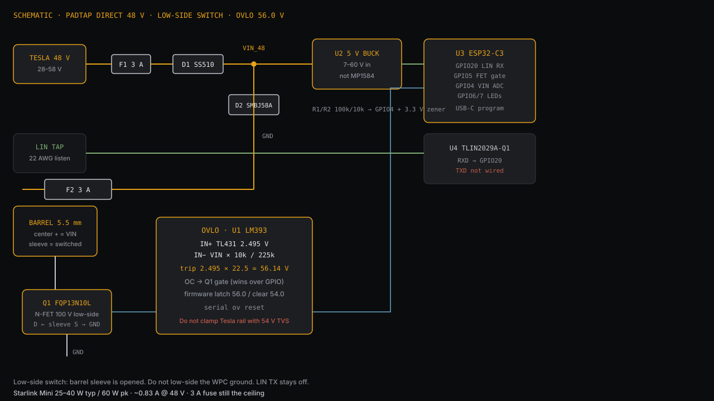
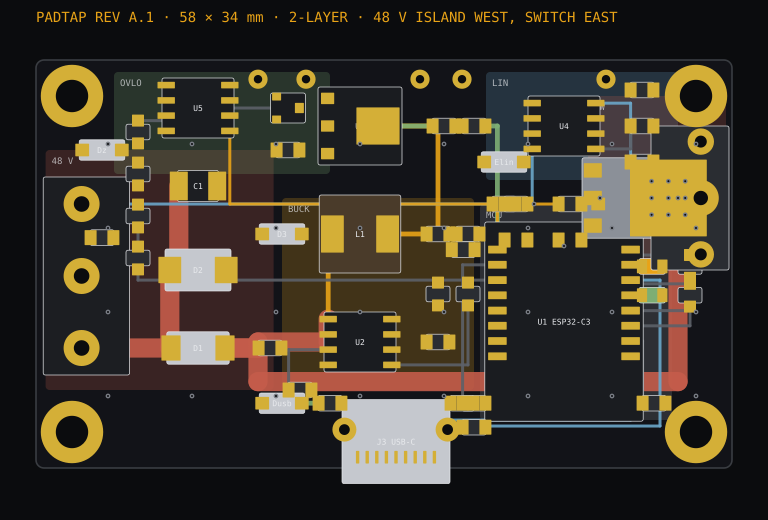
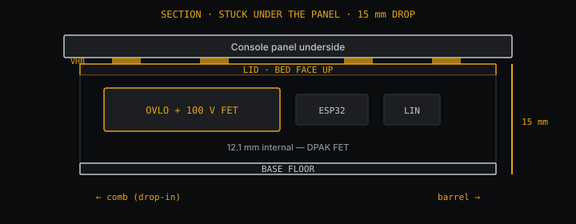

# PadTap

Y-harness + board that steals 48 V from the Cybertruck **wireless charger** to run a **Starlink Mini**, without unplugging the pad.

The charger and the key-card reader are the same module. A 1:1 pass-through keeps NFC, HVAC LIN, and USB alive. The board listens to the on-screen pad toggle (LIN) and switches a 5.5 mm barrel.

This is **not** a Tesla-approved tap. Approved 48 V points are the roof and frunk (400 W). Read [SAFETY.md](SAFETY.md) first.



## Builds

| | **Direct 48 V** (default) | **Buck 36 V** |
| --- | --- | --- |
| Mini sees | Tesla rail, typically 44–50 V | Regulated 36.00 V |
| Tesla 58 V peak | FET opens at **56.0 V** | Buck absorbs it |
| Why | Mini hardware takes ~56 V; skip a conversion, save 4–8 W | Stay inside the printed 12–48 V rating |

Digital fuses on this truck trip on **inrush**, not watts. Both builds use a **10 Ω NTC** on VIN and an **80 ms FET ramp**. Do not skip the thermistor.

## Connector

C X0648 · Tesla **1042593-03-A**. Wire-to-board, not a 4-pin.

| Side | Part |
| --- | --- |
| Vehicle plug | Sumitomo **6098-5718** grey 12-way female |
| Charger | Sumitomo **6098-6210** DL PCB header |

Y: vehicle 5718 → our 6210 (solder a pigtail, pot it) → 1:1 → our 5718 → charger 6210.





| Pin | Color | Terminal | |
| --- | --- | --- | --- |
| **1** | RD/BU 1.00 | 8240-0213 | 48 V HSD — tap |
| 3 | WH/BU 1.00 | 8240-0213 | USB GND thru — no tap |
| **4** | GN 0.35 | 8240-0215 | LIN in — listen only |
| **9** | BN/BU 1.00 | 8240-0213 | WPC GND — tap |
| 10 | GY 0.35 | 8240-0215 | LIN out to HVAC — **never break** |
| 11 / 12 | PK/WH, BU/WH 0.35 | 8240-0215 | CAN auth — no tap |

Latch up, cavities **1–6 over 7–12**. Empty: 2, 5–8. Crimp **18 AWG** into 0213 (16 AWG is out of spec). Full rules: [hardware/harness.md](hardware/harness.md).

## Board

Direct 48 V (`pio run -e direct`):



- ESP32-C3 SuperMini, TLIN2029 **RX only** (TX not wired)
- IRL540NPBF 100 V FET, low-side on the barrel sleeve
- LM393 + TL431 OVLO, trips **56.14 V**
- Littelfuse **0997003.WXN** MINI 3 A **58 V** in and out — not a 32 V blade
- NTC + 80 ms ramp on the harness, outside the box

Buck 36 V is the same Y and sled plus a ≤12 mm 60 V→36 V module. See [hardware/schematic.md](hardware/schematic.md).

```
cd firmware/padtap
pio run -e direct -t upload
pio device monitor -b 115200
```

`mode a` / `b` / `c` / `auto` · `ov reset`

| Mode | |
| --- | --- |
| AUTO | First toggle: latch A if 48 V drops, B if LIN flips |
| A | Follow 48 V |
| B | Follow LIN (expected) |
| C | On whenever the rail is up |

OVLO wins: VIN ≥ 56.0 V → FET off.

## PCB — Rev A.1

**58 × 34 mm**, 2-layer — about 45 % of the sled floor. USB-C on the south window, barrel on the east hole, 40 mm pigtail from J1 to the comb.



| Zone | |
| --- | --- |
| West | 48 V island: TVS + Schottky + 10 µF/100 V. 1.6 mm rail to the barrel along the south edge, not under the MCU |
| Buck | XL7015, short SW node, catch diode on that pin only |
| North | OVLO (LM393 + TL431), away from SW |
| LIN | 1 k + 220 pF + PESD. TXD **10 k to 5 V** (internal pulldown would dominate the bus) |
| East | IRLR3110 DPAK, 9 thermal vias on the tab |

Gerbers: [hardware/pcb/reva/PadTap-RevA-gerbers.zip](hardware/pcb/reva/PadTap-RevA-gerbers.zip). Fuses and NTC stay on the harness. Confirm XL7015 pinout before SMT.

## Case

108 × 56 × 18 mm PETG. VHB the lid under a console panel. Comb west, barrel east, USB-C south. Print [hardware/enclosure](hardware/enclosure) (0.2 mm, 4 perimeters). Confirm 18 mm of clearance.



## Buy and install

Order list with links: **[hardware/shop.md](hardware/shop.md)**.

T20 at **5 N·m**. Meter the official Mini PSU: barrel is 5.5 mm, **center +**. First wake without Starlink — key card and Qi must still work — then plug the Mini.

| | |
| --- | --- |
| [hardware/shop.md](hardware/shop.md) | Housings, terminals, 58 V fuses, tools |
| [hardware/harness.md](hardware/harness.md) | Pin rules |
| [hardware/pcb/reva](hardware/pcb/reva) | Rev A Gerbers, BOM, CPL |
| [firmware/padtap](firmware/padtap) | ESP32-C3 |

MIT. 48 V is live. That is on you.
